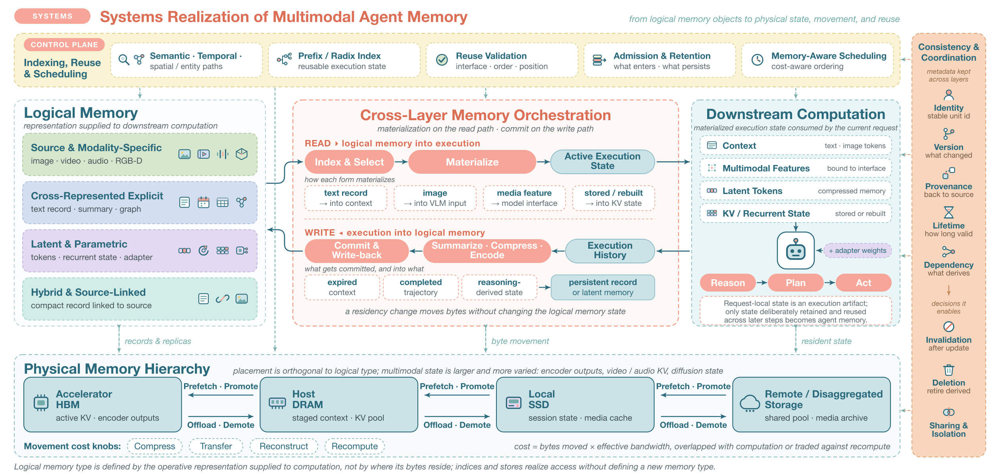

# mm-agent-memory-survey-figures

Survey《Seeing, Maintaining, and Learning: The Evolution of Multimodal Agent Memory》
的矢量插图仓库。每张图由 Python 脚本生成 SVG，再导出 LaTeX 可直接引用的 PDF，
图不手绘、不外部编辑，改图即改脚本。

## 当前图目录

| 图 | 对应章节 | 产物 | 生成脚本 |
| --- | --- | --- | --- |
| Systems Realization of Multimodal Agent Memory | §7.5 Memory Infrastructure and Efficiency | `latex/figures/systems_realization.{pdf,svg,png}` | `code/gen_systems_realization.py` |



这张图把 §7.5.1 的核心论断可视化：逻辑记忆的类型由交给下游计算的
operative representation 定义，与字节住在哪一层存储无关。六个区块分别对应
逻辑记忆四大表示族、跨层 read/write 运行时（§7.5.4）、活跃模型执行、
物理存储层次与数据搬运（§7.5.2）、索引与复用调度控制面（§7.5.3）、
以及贯穿各层的一致性与协调（§7.5.4 结尾）。

## 构建

```bash
bash code/build.sh
```

一条命令产出：主图 SVG、32 个独立图标 SVG、图标总览图、展开版 SVG、PDF、PNG。
依赖：`python3`（无第三方包）、Google Chrome（导 PDF）、
`rsvg-convert`（导 PNG，`brew install librsvg`）。

**PDF 必须走 Chrome headless，不要用 `rsvg-convert -f pdf`**：后者产出 13 个
Type3 字体，arXiv 会告警、IEEE PDF eXpress 会拦；Chrome 只产 Type0 子集。
`code/build.sh` 已固定这条路径，理由见 `docs/systems-realization.md`。

## LaTeX 引用

```latex
\includegraphics[width=\textwidth]{figures/systems_realization.pdf}
```

页面 1260x600 pt，比例 2.1:1。图内字号按 survey 自身插图标定，
放到 506 pt 正文宽时为 4.1 pt（最小副标）到 7.8 pt（主标题），
与 Figure 1/5 的 4.3 到 7.5 pt 同档，不会成为全文最难读的一张。

建议 caption：

> Systems realization of multimodal agent memory. Logical memory (left) is defined by
> the operative representation supplied to downstream computation. A cross-layer runtime
> materializes it into active execution state and commits execution history back.
> Physical placement across HBM, DRAM, SSD, and remote storage (bottom) is orthogonal to
> logical type, while indexing, reuse, and scheduling (top) and consistency and
> coordination (right) apply across all layers.

## 给画图同学的交接物

图里的图标不是下载来的素材，是脚本里手写的矢量图元（`code/icons.py`，
32 个 24x24 symbol，全部由 rect/circle/path 构成）。**没有外部引用、没有内嵌位图、
没有字体依赖**，所以不存在"去哪下载原始图标"的问题，直接从本仓库取即可：

| 要什么 | 拿哪个 |
| --- | --- |
| 单个图标，丢进 Illustrator/Figma 改 | `latex/figures/icons/ic-*.svg`，每个都是独立 24x24 SVG |
| 一眼看全 32 个图标叫什么 | `latex/figures/icons/_contact_sheet.{svg,png}` |
| 整张图，要在设计软件里改 | `latex/figures/systems_realization_flat.svg` |
| 整张图，要继续用脚本改 | `latex/figures/systems_realization.svg` + `code/` |

**设计软件请用 `_flat.svg` 那份**：主图用 `<symbol>`/`<use>` 复用图标，
Illustrator 与 Figma 对这两个标签的支持不一致，容易开出来图标丢失。展开版把
37 处 `<use>` 全部内联，与主图逐像素一致（渲染 PNG 的 SHA-256 相同），
但任何编辑器都能正确打开。

图标命名与含义见 `code/export_icons.py` 里的 `CAPTION` 表；配色沿用下面的
survey 调色板，改图标时直接复用这几个色值即可。

## 约定

- **配色**取自 survey 现有插图：coral `#F8A599`、dark teal `#29697B`、
  muted teal `#72ADAB`、pale cyan `#CBE2E6`、pale yellow `#FAF4D5`、
  pale peach `#F8D6BE`，四个表示族固定用 green `#D6E7CD`、blue `#D3DEF0`、
  lavender `#E3DAF2`、teal `#D2ECE8`。常量集中在生成脚本开头。
- **新增图**沿用同一套骨架：`code/gen_<figure>.py` 写 SVG 到
  `latex/figures/`，`code/build.sh` 追加一段导出。图标复用 `code/icons.py`，
  新图标加进同一个 `SYM` 表并在 `CAPTION` 里写明含义，导出与总览图自动跟上。
- **图内不出现论文名**，避免图随引用变化而失效。

## Source of Truth

- 代码、图产物、文档：本仓库（GitHub 私有 remote，见 `git remote -v`）。
- 不涉及 Hugging Face：本仓库无可复用数据集与模型参数，产物均为
  轻量文本与图片，Git 即正本。
- 设计决策与排版标定记录：`docs/systems-realization.md`。

## 下一步

- survey 的 LaTeX 源若要一并托管，放 `latex/` 下与 `figures/` 同级。
- 其余章节配图按上面的约定逐张补，公用的绘图 helper 到第二张图时
  再抽到 `code/figkit.py`，目前只有一张不提前抽象。图标库已经先抽出来了
  （`code/icons.py`），因为它确定会被多张图复用。
